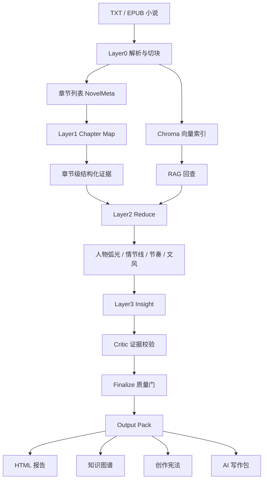

# novel-lab 技术实现文档

## 1. 项目定位

`novel-lab` 是一套面向长篇中文小说，尤其是长篇网文的自动拆解与创作资产生成系统。它不是把小说简单总结成一份报告，而是把一部长篇文本拆成可检索、可校验、可复用的结构化知识资产，最终输出：

- 交互式 HTML 拆解报告
- 知识图谱 `graph.json` / `knowledge_graph.cypher`
- 创作宪法 `creation_constitution.md`
- 下游 AI 写作包 `ai_writing_pack/`
- 全量结构化分析 `novel_analysis.json`
- 可量化指标 `metrics.json`

项目的核心目标是解决一个实际问题：**长篇小说不能直接塞给大模型分析**。一方面，长篇文本超过模型上下文窗口；另一方面，即便能塞进去，一次性摘要也会丢失章节级细节、人物弧光、伏笔回收、主线/暗线连续性、爽点节奏和风格证据。

因此本项目采用“分层金字塔 + Map-Reduce + RAG + 自我校验 + 输出资产化”的技术架构。

## 2. 长篇小说分析的核心难点

### 2.1 上下文过长

百万字级小说通常包含数百到数千章。直接输入 LLM 会遇到：

- 上下文窗口不足
- 成本极高
- 模型注意力集中在开头和结尾，中段信息丢失
- 输出容易变成泛泛摘要

本项目的处理方式是：

- 先按章节切分
- 再按章节内语义切块建立向量索引
- Layer1 对单章并行抽取结构化证据
- Layer2/3 只消费结构化摘要和必要的 RAG 片段

对应实现：

- `src/novel_lab/ingest/parser.py`
- `src/novel_lab/ingest/chunker.py`
- `src/novel_lab/ingest/indexer.py`
- `src/novel_lab/orchestrator/pipeline.py`

### 2.2 章节级细节容易丢失

传统“整本摘要”会丢掉：

- 金句
- 章末钩子
- 场景地点
- 人物行为
- 情感变化
- 套路命中
- 主线/暗线推进节点

本项目把这些内容放在 Layer1 每章级 Map 阶段捕获，后续 Reduce 不再从原文盲猜，而是沿着章节级证据汇总。

当前 Layer1 输出包括：

- `mentioned_characters`
- `scenes`
- `hooks`
- `quotes`
- `tropes`
- `line_signals`

其中 `line_signals` 是近期新增的关键字段，用于提前捕获每章是否推进主线、经济暗线、权力暗线、情感暗线或副线。

对应实现：

- `src/novel_lab/schema.py`
- `src/novel_lab/agents/map/chapter_agent.py`
- `config/prompts/map_chapter.md`

### 2.3 主线/暗线容易断裂

长篇小说的主线不是几章内的事件，而是贯穿全书的因果链。暗线也不应该只有开头、没有中段和尾段回收。

为此项目做了三层保障：

1. Layer1 每章提取 `line_signals`
2. Layer2 用 `line_signals` 聚合主线、经济暗线、权力暗线、情感暗线、副线
3. Layer2.5 用 RAG 回查关键章节，并做连续性修复

连续性修复包括：

- 同章事件去重
- 大跨度事件之间补“承接推进”节点
- 尾段缺失时补“阶段回收”锚点
- 主线缺少前段事件时补“主线起势”
- 生成 `line_continuity` 指标供报告展示

对应实现：

- `src/novel_lab/agents/reduce/plotline_separator.py`
- `src/novel_lab/orchestrator/pipeline.py`
- `config/prompts/reduce_plotline.md`
- `config/prompts/reduce_plotline_refine.md`
- `viz/templates/report.html.j2`

## 3. 总体架构



### 3.1 分层说明

| 层级 | 名称 | 主要职责 | 关键代码 |
|---|---|---|---|
| Layer0 | Ingest | 解析 TXT/EPUB、章节切分、语义切块、向量索引 | `ingest/` |
| Layer1 | Map | 每章并发抽取结构化证据 | `agents/map/` |
| Layer2 | Reduce | 汇总人物、情节线、节奏、文风 | `agents/reduce/` |
| Layer2.5 | Plotline Refine | 用 RAG 和章节流水复核主线/暗线连续性 | `pipeline.py` |
| Layer3 | Insight | 提炼差异化、读者爽点归因、弃书风险 | `agents/insight/` |
| Layer3.5 | Critic | 基于 evidence chapter 回查原文校验结论 | `agents/insight/critic.py` |
| Layer4 | Output | 生成报告、图谱、创作宪法、写作包 | `output/`, `graph/`, `viz/` |

## 4. Layer0：预处理、切块与 RAG

### 4.1 TXT / EPUB 解析

`parser.py` 支持：

- TXT 多编码读取：`utf-8`、`utf-8-sig`、`gbk`、`gb18030`、`big5`
- 中文章节识别：`第N章`、`第N回`、`第N节`、`第N折`
- 卷信息识别：`第N卷`
- EPUB HTML 文本抽取
- 基于标题和正文生成稳定 `book_id`

输出为 `NovelMeta`：

- `book_id`
- `title`
- `author`
- `genre`
- `total_chapters`
- `total_chars`
- `chapters`

### 4.2 章节内语义切块

`chunker.py` 把每章作为 parent context，再切成 child chunks：

- 默认 chunk size 约 384 token
- overlap 约 64 token
- 分隔符优先级适配中文：段落、句号、感叹号、问号、分号、逗号
- 用 `tiktoken` 估算 token，离线时按中文字符数兜底

### 4.3 向量索引

`indexer.py` 使用 Chroma 持久化向量索引：

- Parent：整章原文
- Child：章节内语义切块
- 检索时先命中 child，再返回 parent 章节上下文

当前 RAG 用途：

- Critic 校验结论时取 evidence chapter 原文
- Plotline refine 阶段回查中后段关键章节，修复主线/暗线断裂

### 4.4 DashScope Embedding

`dashscope_embeddings.py` 实现阿里云百炼 OpenAI-compatible embedding：

- 默认模型：`text-embedding-v4`
- 支持 `DASHSCOPE_COMPAT_BASE_URL`
- 支持 `EMBEDDING_DIMENSIONS`
- 自动限制 `EMBEDDING_BATCH_SIZE <= 10`，符合 `text-embedding-v4` 单次最多 10 条输入的限制
- HTTP 400 时会输出 DashScope 响应正文，方便排查

推荐配置：

```env
DASHSCOPE_API_KEY=sk-xxx
DASHSCOPE_COMPAT_BASE_URL=https://dashscope.aliyuncs.com/compatible-mode/v1
EMBEDDING_BACKEND=dashscope
EMBEDDING_DS_MODEL=text-embedding-v4
EMBEDDING_DIMENSIONS=1024
EMBEDDING_BATCH_SIZE=10
NOVEL_LAB_SKIP_INDEX=0
NOVEL_LAB_FORCE_REINDEX=1
```

## 5. LLM 路由层

`src/novel_lab/llm/router.py` 封装所有模型调用。

### 5.1 Role-based 路由

系统按任务角色选择模型：

| Tier | map | reduce | critic | deep |
|---|---|---|---|---|
| basic | DeepSeek | DeepSeek | DeepSeek | DeepSeek |
| balanced | DeepSeek | Claude | Claude | Claude |
| premium | Claude | Claude | Claude | Claude |
| local | local | local | local | Claude |

### 5.2 工程能力

路由层提供：

- OpenAI-compatible DeepSeek 调用
- Anthropic Claude 调用
- 本地 OpenAI-compatible 模型调用
- JSON mode
- 指数退避重试
- RateLimiter 限流
- token 统计与成本估算
- SQLite LLM cache
- key 预检查，避免 `ANTHROPIC_API_KEY=sk-ant-xxxxxxxx` 这类占位值导致 Reduce 全失败

### 5.3 成本策略

默认建议：

- `basic`：全 DeepSeek，成本低，适合批量跑和调试
- `balanced`：Map 用 DeepSeek，Reduce/Insight/Critic 用 Claude，适合高质量报告

## 6. Layer1：章节级 Map Agent

Layer1 是系统质量的基础。每章单独输入 LLM，输出结构化证据。

实现：

- `src/novel_lab/agents/map/chapter_agent.py`
- `src/novel_lab/agents/map/runner.py`
- `config/prompts/map_chapter.md`

### 6.1 为什么要在第一层抽证据

长篇 Reduce 阶段不能再回读所有原文，所以第一层必须像读书笔记一样记录证据。这样后续分析主线、人物、爽点、风格时有结构化材料可用。

### 6.2 单章输出

`ChapterAnalysis` 包含：

- `summary`：本章摘要
- `mentioned_characters`：人物提及、行为、情绪、关系更新
- `scenes`：地点、时间线索、参与者
- `hooks`：爽点/钩子，含类型、强度、位置、原文片段
- `quotes`：金句，要求必须来自原文
- `tropes`：题材套路命中
- `line_signals`：章节级线路信号

### 6.3 line_signals：主线/暗线的早期锚点

`line_signals` 是当前项目的重要升级点。

字段：

- `line`：`main | economic | power | emotional | sub | none`
- `status`：`setup | advance | twist | payoff | cooldown`
- `event`：本章该线发生了什么
- `impact`：该节点造成什么变化
- `characters`：相关角色
- `snippet`：原文证据片段
- `evidence_chapter`
- `confidence`

它解决的问题是：**主线/暗线不能只在 Reduce 阶段凭摘要猜，而要在每章先标注“这章推进了哪条线”。**

### 6.4 并发与断点续跑

`runner.py` 通过：

- `asyncio.Semaphore`
- `MAP_CHAPTER_TIMEOUT_SEC`
- `MapCheckpoint`
- SQLite `map.sqlite`

实现章节级并发、超时降级和断点续跑。

## 7. Layer2：Reduce 聚合智能体

Layer2 把章节级证据聚合成全书级结构。

### 7.1 人物弧光 ArcTracker

实现：

- `src/novel_lab/agents/reduce/arc_tracker.py`
- `config/prompts/reduce_arc.md`

流程：

1. 收集每章 `mentioned_characters`
2. 基于名字包含关系做简单别名归并
3. 取出现频率最高的人物
4. 分 batch 生成角色档案

输出：

- 角色 ID
- 别名
- 角色定位
- 动机
- 缺陷
- 出场章节
- 五状态弧光
- 关系演化

### 7.2 主线/暗线 PlotlineSeparator

实现：

- `src/novel_lab/agents/reduce/plotline_separator.py`
- `config/prompts/reduce_plotline.md`

处理逻辑：

- 章节数较少时一次性聚合
- 长篇按 `_BATCH_CHAPTERS = 50` 分批生成局部情节线
- 再把局部情节线合并为全书线索

输入不仅包含摘要和 hooks，还包含 `line_signals`。

输出：

- 主线 `main`
- 经济暗线 `economic`
- 权力暗线 `power`
- 情感暗线 `emotional`
- 副线 `sub`
- 每条线的事件序列和交汇点

### 7.3 情节线连续性修复

实现：

- `Pipeline._refine_plotlines_with_raw_trace`
- `Pipeline._collect_plotline_rag_hits`
- `Pipeline._stitch_plotline_continuity`
- `Pipeline._build_line_continuity`

处理能力：

- RAG 回查中后段关键章节
- 把 `rag_hits`、`chapter_traces`、`line_signals` 一起喂给 refine prompt
- 修复事件跨度过大
- 补尾段回收
- 生成分线总结 `line_briefs_llm`
- 如果 LLM 总结为空，自动回退到确定性 `longform_briefs`

### 7.4 节奏分析 PacingAnalyzer

实现：

- `src/novel_lab/agents/reduce/pacing_analyzer.py`

这是确定性模块，不依赖 LLM。

指标：

- 每章最大爽点强度
- 平均高峰间隔
- 每章小钩子数量
- 每 5 章中等钩子数量
- 大高潮章节
- 弃书风险区间

逻辑：

- `intensity >= 4` 视为高峰
- `intensity == 5` 视为大高潮
- 连续若干章无中等以上爽点，标记为弃书风险

### 7.5 文风指纹 StyleFingerprint

实现：

- `src/novel_lab/agents/reduce/style_fingerprint.py`
- `config/prompts/reduce_style.md`

做法：

- 从开头、中段、末尾均匀抽样 8-12 段原文
- 交给 LLM 输出文风结构

输出：

- POV
- 时态
- 平均句长
- 对白比例
- 描写浓度
- 修辞设备
- 调性关键词
- 标志性短语
- 示例段落

## 8. Layer3：深度洞察与 Critic

### 8.1 全书上下文构造

`agents/insight/_common.py` 把 Reduce 结果压缩成全书上下文：

- top hooks
- plotlines
- characters
- pacing
- style
- chapter briefs
- genre tropes
- anti patterns

### 8.2 三类洞察

当前包括：

- `DifferentiationAgent`：提炼差异化亮点
- `ReaderHookAgent`：分析读者爽点心理机制
- `DropRiskAgent`：识别弃书风险与修复建议

输出模型：

- `DifferentiationPoint`
- `ReaderHookCausation`
- `DropRisk`

### 8.3 Critic 校验

实现：

- `src/novel_lab/agents/insight/critic.py`

Critic 的作用是降低幻觉。

流程：

1. 收集洞察 claim
2. 根据 `evidence_chapter` 回查原文章节
3. 让 Critic 判断结论是否被证据支持
4. 未通过的结论降低 `confidence`

这种设计保留了分析结果，但用置信度标记风险，避免粗暴删除导致报告空洞。

## 9. Finalize：质量门与兜底

`Pipeline._finalize` 会做最终质量门：

- 抽取 top quotes
- 统计 top tropes
- 计算 metrics
- 写入 `novel_analysis.json`

质量兜底包括：

- plotlines 为空时根据章节摘要自动回填主线
- differentiation 过少时自动补基础差异点
- reader hooks 过少时从 hooks 分布中恢复
- drop risks 为空时从 pacing 风险区恢复
- line briefs 为空时回退到 deterministic longform briefs

对应实现：

- `Pipeline._quality_gate_recover`
- `Pipeline._recover_plotlines_if_empty`
- `Pipeline._recover_differentiation`
- `Pipeline._recover_reader_hooks`
- `Pipeline._recover_drop_risks`
- `Pipeline._build_longform_briefs`
- `Pipeline._build_line_continuity`

## 10. 知识图谱

实现：

- `src/novel_lab/graph/builder.py`

图谱输出两种格式：

- `knowledge_graph.cypher`：可导入 Neo4j
- `graph.json`：给 Cytoscape.js 前端渲染

节点类型：

- `Book`
- `Chapter`
- `Character`
- `Location`
- `Event`
- `Trope`
- `Quote`

关系类型：

- `CONTAINS_CHAPTER`
- `APPEARS_IN`
- `EVOLVES_TO`
- `RELATIONSHIP_WITH`
- `SET_IN`
- `BELONGS_TO_LINE`
- `PARTICIPATES_IN`
- `USES_TROPE`
- `CONTAINS_QUOTE`

亮点是：报告不是纯文本，而是可以把人物、章节、事件、套路和金句组成一个可视化关系网络。

## 11. 输出层

统一输出由 `OutputPackBuilder` 完成：

- `src/novel_lab/output/pack.py`

### 11.1 HTML 报告

实现：

- `src/novel_lab/output/html_report.py`
- `viz/templates/report.html.j2`

可视化组件：

- ECharts：爽点强度曲线、钩子类型分布、主线/暗线时间轴
- Cytoscape.js：知识图谱
- HTML details/table：人物档案、分线总结、风险建议、金句、套路

当前报告重点强化：

- 主线/暗线连续性体检
- 主线/经济暗线/权力暗线/情感暗线/副线中文标签
- 每个情节节点展示“节点事件 / 发生了什么 / 造成什么变化”
- 长篇智能体总结为空时自动回退

### 11.2 创作宪法

实现：

- `src/novel_lab/output/constitution.py`
- `config/prompts/constitution.md`

内容包括：

- 题材定位
- 核心爽点公式
- 人物塑造模板
- 节奏规范
- 文风约束
- 必避雷区
- 可复用写作规则

### 11.3 AI Writing Pack

实现：

- `src/novel_lab/output/ai_pack.py`

输出：

- `system_prompt.md`
- `style_few_shot.md`
- `characters.yaml`
- `tropes.json`
- `plot_skeleton.md`
- `creation_constitution.md`

设计目的：让下游 LLM 不只是“看报告”，而是可以直接导入这些文件进行同款/同人创作。

## 12. CLI 与运行体验

实现：

- `src/novel_lab/cli.py`

主要命令：

```bash
novel-lab analyze <path> \
  --genre generic \
  --tier basic \
  --rag \
  --resume
```

CLI 能力：

- Typer 命令行入口
- Rich 进度条
- 配置预检查
- 持续输出当前阶段和智能体任务

当前控制台会显示：

- ingest
- index start / index done
- Layer1 Map 章节进度
- Layer2 Reduce 开始、各 reduce agent 开始/完成
- plotline refine 开始/完成
- Layer3 Insight 各 agent 开始/完成
- Critic 校对条数
- Finalize
- Output pack 生成

这对长任务很重要，因为用户能看到当前卡在哪个阶段、哪个智能体正在做什么。

## 13. 持久化与断点续跑

项目有多层持久化：

- `meta.json`：书籍元信息
- `checkpoints/map.sqlite`：每章 Map 结果
- `checkpoints/stages.sqlite`：阶段级 checkpoint
- `.workdir/llm_cache.sqlite`：LLM 调用缓存
- `chroma/`：向量库
- `novel_analysis.json`：最终结构化结果
- `output_pack/`：最终产物

收益：

- 中断后可续跑
- Map 阶段不重复花钱
- LLM 响应可缓存
- 向量索引可复用

## 14. 成本与质量策略

### 14.1 成本控制

- Layer1 每章并发，单章上下文有限
- `basic` 档全 DeepSeek，成本低
- LLM cache 避免重复请求
- Map checkpoint 避免重跑章节
- RAG 只在必要阶段回查，不把全书塞给 LLM

### 14.2 质量控制

- 所有结论型模型继承 `Evidenced`
- 关键字段带 `evidence_chapter`
- 金句和 line signal snippet 做原文包含校验
- Critic 根据原文证据校验洞察
- Finalize 有质量门兜底
- 报告有 continuity 指标暴露结构风险

## 15. 项目亮点总结

### 15.1 真正面向长篇，而不是一次性摘要

项目把长篇拆成章节、切块、证据、聚合、洞察多个层级，避免一次性摘要丢失中段和细节。

### 15.2 Map-Reduce 结构清晰

Layer1 负责“证据采集”，Layer2 负责“结构归并”，Layer3 负责“解释与判断”。职责边界清楚，易扩展。

### 15.3 主线/暗线有专门机制

新增 `line_signals` 后，主线、经济暗线、权力暗线、情感暗线、副线不再只靠最终 LLM 猜，而是从章节级就开始积累证据。

### 15.4 RAG 用在关键处

RAG 不是为了炫技，而是用于：

- Critic 校验证据
- Plotline refine 回查中后段关键章节

这两个位置都直接对应长篇分析的痛点。

### 15.5 输出是资产，不只是报告

系统最终生成：

- 可读报告
- 可导图谱
- 可复用创作宪法
- 可直接导入 LLM 的写作包

因此项目从“分析工具”进一步变成“创作基础设施”。

### 15.6 工程可运行性较强

项目已经具备：

- CLI
- Rich 进度条
- checkpoint
- cache
- env 配置
- 失败兜底
- 可选 Neo4j
- 可选本地/云模型

这让它不只是 demo，而是可以反复跑长文本任务的工程化流水线。

## 16. 当前限制与后续优化方向

### 16.1 当前限制

- `basic` 全 DeepSeek 时，Reduce 质量可能低于 Claude
- 超长篇情况下，plotline refine 仍依赖 LLM JSON 稳定性
- 章节切分对非常规排版文本仍可能需要手工清洗
- 评论挖掘与读者反馈校准虽然已有 Phase2 目录，但还不是主分析链的默认必选环节

### 16.2 建议后续优化

- 为 `reduce_plotline_refine` 增加 JSON repair
- 把 `line_signals` 做成报告中的线路热力图
- 增加每条线的“伏笔-回收”自动配对
- 增加多书对比基线库
- 把评论挖掘结果并入 ReaderHook 和 DropRisk
- 给 Output Pack 增加章节级创作模板

## 17. 一句话总结

`novel-lab` 的核心价值是：**把一部长篇小说从不可控的超长文本，转化为可检索、可校验、可视化、可复用的创作知识资产。**

它通过章节级 Map、分层 Reduce、RAG 回查、证据校验和输出资产化，解决了长篇小说分析中最难的上下文长度、细节丢失、主线断裂和下游不可复用问题。
